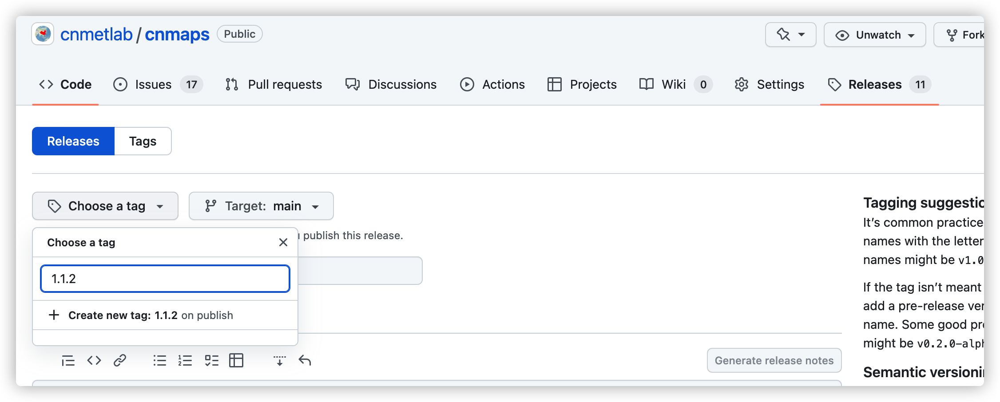

发布你的 Python 包
======================
当你已经在本地完成包的开发以后，就需要把包发布出来，大家才可以使用。通常情况下，Python 的包发布渠道有 3 个，GitHub 上发布发布源码安装包、Pypi.org 上发布安装包、Anaconda.org 上发布安装包。

在 Github 上发布 release
----------------------------
在 GitHub 上发布源码安装包是一个很简单的发布方式，直接在代码仓库的 release 选项卡里点击 Releases，然后在 Choose a tag 按钮上找到你要打包的 tag，如果没有 tag 可以手动输入一个 tag 名称然后点击下方的 Create a new tag 按钮创建 tag。

这种方式发布的包，需要用户自己去 Releases 列表里下载压缩包，然后解压缩再执行 ``python setup.py install`` 来进行安装。

发布到 Pypi.org
------------------
Python 包的分发更常见的应该是通过包管理器进行分发，这样用户在安装的时候就可以享受很多便利。我们平时使用的 ``pip`` 就是一个包管理工具，它可以直接安装发布于 Pypi.org 包索引目录里的包。

在 `pypi.org <https://pypi.org/>`_ 上发布我们的包之前，需要我们去该网站上注册一个自己的账号。当然，为了方便测试，Pypi.org 还制作了一个专门用于测试的 pypi 网站 `test.pypi.org <https://test.pypi.org/>`_ 。我建议在这个测试网站上也注册一个账号，我们可以先把需要测试的包发布到这里来验证整个步骤，以免犯错。

在完成账号准备以后，我们先对仓库进行打包，在 ``setup.py`` 同级目录下执行：

.. code:: bash

    python setup.py sdist

之后我们就可以在 dist 目录下看到我们打好的压缩包文件了。为了方便上传，我们可以先安装 twine： 

.. code:: bash

    pip install twine

之后执行上传到 test.pypi.org 的命令:

.. code:: bash

    twine upload --repository-url https://test.pypi.org/legacy/ dist/*

上述命令执行以后会提示你输入在 test.pypi.org 网站上的账号密码。如果一切顺利，我们就可以在 `test.pypi.org <https://test.pypi.org/>`_ 网站上搜索到我们上传的包了。

要从 test.pypi.org 里安装上传的包也很简单，只需要在 pip 命令中添加一个 ``--index-url https://test.pypi.org/simple`` 的参数即可，例如：

.. code:: bash

    pip install --index-url https://test.pypi.org/simple <your package name>

如果安装以后一切都 OK，那么就可以把上面的 ``--repository-url https://test.pypi.org`` 参数去掉，按默认的上传到真实的 pypi.org 包索引中去。

.. note::

    关于轮子构建，在 Python 中轮子文件(.whl)是一个预编译的二进制文件，它可以封装前置二进制依赖以加快安装速度，降低包安装的复杂度。如果有需要，也可以用于代码加密。但是由于它是预编译的，因此需要对操作系统做适配，我们经常看到的安装的时候提示的一堆类似于 ``*-cp310-cp310-macosx_10_9_x86_64.macosx_11_0_arm64.macosx_10_9*`` 的字符串，就是根据你的操作系统记性适配的一串标识。由于对多种操作系统做预编译，就需要使用多种操作系统进行，或者使用特殊的工具构建，相对来说比较繁琐，因此我们这里就暂时不对这种发布格式做过多的介绍。
    如果想要尝试，可以在 ``python setup.py sdist`` 这一步中将命令替换为： ``python setup.py sdist bdist_wheel``，就会在 dist 目录中构建一个轮子文件。

发布到 Anaconda.org
-----------------------

