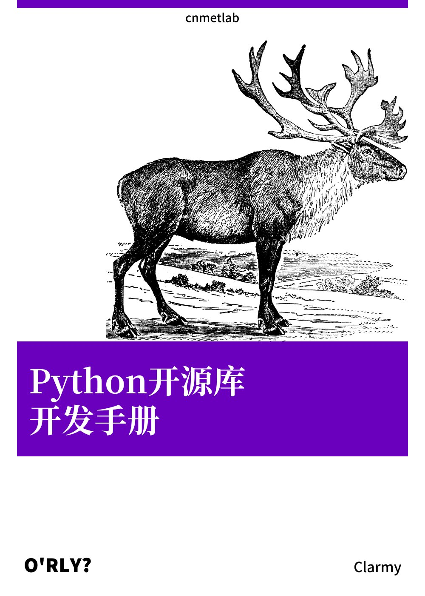

.. Python 开源库开发手册 documentation master file, created by
   sphinx-quickstart on Mon Aug 22 23:24:44 2022.
   You can adapt this file completely to your liking, but it should at least
   contain the root `toctree` directive.

Python 开源库开发手册
==================================

《Python 开源库开发手册》是一个教你如何开发和迭代一个第三方 Python 开源库的教程。

如果你想了解一个 Python 库包是如何构建、分发，如何编写单元测试并利用CI工具对项目进行自动化测试，如何为项目编写使用手册等等，那么本手册将给你答案。

目录
---------

.. toctree::
   :maxdepth: 3

   content/make-package
   content/publish
   content/tests
   content/ci
   content/documentation
   content/benchmark
   content/codacy
   content/codecov
   content/statistic